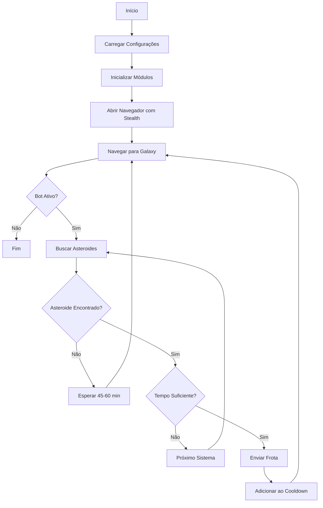

# 🤖 Raidex-NinjaBot - Bot de Mineração de Asteroides para Ogamex

Bot automatizado inteligente para mineração de asteroides no jogo Ogamex, com interface web moderna para controle e monitoramento em tempo real.

## 📋 Índice

- [Características](#-características)
- [Capturas de Tela](#-capturas-de-tela)
- [Instalação](#-instalação)
- [Configuração](#-configuração)
- [Uso](#-uso)
- [Arquitetura](#-arquitetura)
- [Documentação](#-documentação)
- [Solução de Problemas](#-solução-de-problemas)

## ✨ Características

### 🎯 Mineração Automática de Asteroides
- **Busca Contínua**: Procura asteroides automaticamente em intervalos configuráveis
- **Rastreamento Inteligente**: Sistema de cooldown por coordenadas específicas evita duplicatas
- **Cálculo de Tempo de Viagem**: Valida se o tempo do asteroide é suficiente para a viagem
- **Seleção Automática de Frotas**: Seleciona e envia grupos de frotas configuráveis
- **Modo Stealth**: Evasões anti-detecção de bot integradas

### 🌐 Interface Web Moderna
- **Painel de Controle**: Inicie/pare o bot com um clique
- **Logs em Tempo Real**: Acompanhe todas as ações do bot
- **Gerenciamento de Cooldowns**: Visualize asteroides em cooldown
- **Gerenciamento de Império**: Visualize planetas, recursos e frotas
- **Configuração Dinâmica**: Ajuste configurações sem reiniciar

### 🏭 Gerenciamento de Império
- **Crawling Automático**: Coleta dados de todos os planetas
- **Dashboard de Recursos**: Visualize recursos, produção e capacidade
- **Status de Frotas**: Monitore frotas disponíveis por planeta
- **Informações de Construção**: Acompanhe construções e pesquisas

### 🚀 Automação de Expedições
- **Envio Automático**: Envia expedições continuamente de um planeta selecionado
- **Modo Sono**: Pausa as operações em horários configuráveis para simular humano
- **Gestão de Slots**: Monitora e utiliza slots de expedição disponíveis

### 🧠 Brain (Auto Builder)
- **Construção Inteligente**: Gerencia filas de construção baseadas em metas
- **Metas Configuráveis**: Defina níveis alvo para minas, fábricas e hangares
- **Otimização de Recursos**: Verifica recursos e constrói assim que possível

### 🥷 Modo Stealth
- **Evasões de WebDriver**: Remove ou oculta propriedades de detecção
- **Emulação de Permissões**: Simula permissões de navegador real
- **User-Agent Realista**: Utiliza user-agents de navegadores reais
- **Perfil de Navegador Persistente**: Mantém sessão de login

## 📸 Capturas de Tela

### Interface do Minerador de Asteroides

*Painel principal com logs em tempo real e controles do bot*

### Interface de Gerenciamento de Império

*Dashboard do império mostrando todos os planetas, recursos e frotas*

## 🚀 Instalação

### Pré-requisitos

- **Python 3.8+** instalado
- **Navegador Chromium** (instalado automaticamente pelo Playwright)

### Passos de Instalação

1. **Clone o repositório**:
   ```bash
   git clone https://github.com/Werikson1/raidex-ninjabot.git
   cd raidex-ninjabot
   ```

2. **Instale as dependências**:
   ```bash
   pip install -r requirements.txt
   ```

3. **Instale o navegador Playwright**:
   ```bash
   playwright install chromium
   ```

4. **Configure o bot**:
   - Edite `config.json` com suas configurações (veja [Configuração](#-configuração))

5. **Primeiro Login** (importante):
   ```bash
   python bot.py
   ```
   - O navegador abrirá automaticamente
   - Faça login manualmente no Ogamex
   - O bot salvará sua sessão para uso futuro
   - Pressione `Ctrl+C` para parar o bot após o login

## ⚙️ Configuração

### Arquivo `config.json`

Edite o arquivo `config.json` na raiz do projeto:

```json
{
    "HEADLESS_MODE": false,
    "FLEET_GROUP_NAME": "300 MM",
    "COOLDOWN_HOURS": 1,
    "SEARCH_DELAY_MIN": 0.3,
    "SEARCH_DELAY_MAX": 1,
    "NO_ASTEROID_WAIT_MIN": 45,
    "NO_ASTEROID_WAIT_MAX": 60,
    "FLEET_FAIL_WAIT_MINUTES": 50
}
```

### Parâmetros de Configuração

| Parâmetro | Descrição | Padrão |
|-----------|-----------|--------|
| `HEADLESS_MODE` | Executar navegador invisível | `false` |
| `FLEET_GROUP_NAME` | Nome do grupo de frota a usar | `"300 MM"` |
| `COOLDOWN_HOURS` | Horas de cooldown para asteroides | `1` |
| `SEARCH_DELAY_MIN` | Delay mínimo entre buscas (s) | `0.3` |
| `SEARCH_DELAY_MAX` | Delay máximo entre buscas (s) | `1` |
| `NO_ASTEROID_WAIT_MIN` | Espera mínima sem asteroides (min) | `45` |
| `NO_ASTEROID_WAIT_MAX` | Espera máxima sem asteroides (min) | `60` |
| `FLEET_FAIL_WAIT_MINUTES` | Espera após falha de envio (min) | `50` |

### Grupos de Frotas Disponíveis

- `"220 MM"` - 220 Pequeno Cargueiro
- `"200 MM"` - 200 Pequeno Cargueiro
- `"150 MM"` - 150 Pequeno Cargueiro
- `"320 MM"` - 320 Pequeno Cargueiro
- `"250 MM"` - 250 Pequeno Cargueiro
- `"300 MM"` - 300 Pequeno Cargueiro

📖 **Para configurações avançadas**, consulte [`docs/CONFIGURATION.md`](docs/CONFIGURATION.md)

## 🎮 Uso

### Modo 1: Linha de Comando (Legado)

```bash
python bot.py
```

- O bot iniciará automaticamente
- Logs serão exibidos no console
- Pressione `Ctrl+C` para parar

### Modo 2: Interface Web (Recomendado)

1. **Inicie o servidor web**:
   ```bash
   python web_app.py
   ```

2. **Acesse a interface**:
   - Abra seu navegador em `http://localhost:5000`

3. **Use a interface**:
   - **Aba "Asteroid Miner"**: Controle o bot de mineração
   - **Aba "Empire"**: Visualize seu império
   - **Aba "Expedition"**: Configure e inicie expedições automáticas
   - **Aba "Brain"**: Defina metas de construção para seus planetas

### Funcionalidades da Interface Web

#### Painel de Controle
- ▶️ **Start Bot**: Inicia a mineração automática
- ⏹️ **Stop Bot**: Para o bot
- 🔄 **Refresh**: Atualiza logs e cooldowns

#### Logs em Tempo Real
- Visualize todas as ações do bot
- Timestamps precisos
- Indicadores emoji para fácil leitura

#### Visualização de Cooldowns
- Lista de asteroides em cooldown
- Tempo restante para cada asteroide
- Atualização automática

#### Gerenciamento de Império
- Dashboard de todos os planetas
- Recursos atuais e capacidade de armazenamento
- Produção por hora
- Frotas disponíveis
- Construções e pesquisas em andamento
- Botão "Crawl Empire" para atualização manual

## 🏗️ Arquitetura

### Estrutura do Projeto

```
raidex-ninjabot/
├── bot.py                      # Orquestrador principal
├── web_app.py                  # Servidor Flask da interface web
├── config.json                 # Configurações do usuário
├── requirements.txt            # Dependências Python
├── modules/                    # Módulos do bot
│   ├── __init__.py
│   ├── asteroid_finder.py      # Busca de asteroides
│   ├── cooldown_manager.py     # Gerenciamento de cooldowns
│   ├── empire_manager.py       # Gerenciamento do império
│   ├── fleet_dispatcher.py     # Envio de frotas
│   ├── stealth.py              # Evasões anti-detecção
│   └── config.py               # Carregamento de configurações
├── templates/                  # Templates HTML
│   ├── base.html
│   ├── asteroid_miner.html
│   └── empire.html
├── static/                     # Arquivos estáticos (CSS, JS)
├── user_data/                  # Perfil persistente do navegador
├── asteroid_cooldowns.json     # Dados de cooldown (auto-gerado)
└── empire_data.json            # Dados do império (auto-gerado)
```

### Módulos Principais

| Módulo | Responsabilidade |
|--------|------------------|
| `bot.py` | Orquestração principal, loop de execução, threading |
| `asteroid_finder.py` | Detecção de asteroides, parsing de modais, busca em sistemas |
| `cooldown_manager.py` | Rastreamento de cooldown por coordenadas específicas |
| `empire_manager.py` | Coleta e parsing de dados do império |
| `expedition_runner.py` | Gerenciamento e envio de expedições automáticas |
| `brain.py` | Lógica de construção automática e gerenciamento de metas |
| `fleet_dispatcher.py` | Seleção de frota, navegação no wizard, envio |
| `stealth.py` | Evasões de detecção de bot via JavaScript |
| `config.py` | Carregamento e validação de configurações |
| `web_app.py` | API REST, renderização de templates, endpoints |

### Fluxo de Execução



## 📚 Documentação

- **[CONFIGURATION.md](docs/CONFIGURATION.md)**: Guia completo de configuração
- **[API.md](docs/API.md)**: Documentação da API REST
- **[MODULES.md](docs/MODULES.md)**: Documentação detalhada dos módulos
- **[walkthrough.md](docs/walkthrough.md)**: Walkthrough técnico completo

## 🔧 Solução de Problemas

### Bot não encontra asteroides

**Possíveis causas**:
- Nenhum asteroide disponível no momento
- Todos os asteroides estão em cooldown
- Problema na detecção do botão "Find asteroids"

**Soluções**:
1. Verifique os logs para mensagens de erro
2. Reduza o `COOLDOWN_HOURS` se muitos asteroides estão em cooldown
3. Aguarde - o bot espera automaticamente 45-60 minutos

### Bot não consegue enviar frotas

**Possíveis causas**:
- Grupo de frotas não disponível no planeta
- Frota em missão
- Nome do grupo de frotas incorreto

**Soluções**:
1. Verifique se o `FLEET_GROUP_NAME` está correto
2. Certifique-se de que você criou o grupo de frotas no jogo
3. Verifique se há naves disponíveis no planeta base

### Interface web não carrega

**Possíveis causas**:
- Porta 5000 já em uso
- Dependências não instaladas

**Soluções**:
1. Instale as dependências: `pip install -r requirements.txt`
2. Verifique se a porta 5000 está livre
3. Tente acessar `http://127.0.0.1:5000` ao invés de `localhost`

### Navegador não abre ou fecha imediatamente

**Possíveis causas**:
- Playwright não instalado corretamente
- Chromium não foi baixado

**Soluções**:
```bash
playwright install chromium
```

### Erro "Bot detection" ou bloqueio

**Possíveis causas**:
- Modo stealth não funcionando
- Delays muito curtos

**Soluções**:
1. Aumente os delays em `config.json`:
   ```json
   {
       "SEARCH_DELAY_MIN": 1.0,
       "SEARCH_DELAY_MAX": 2.0
   }
   ```
2. Use `HEADLESS_MODE: false` para parecer mais humano

### Sessão de login perdida

**Possíveis causas**:
- Pasta `user_data` deletada
- Cookies expirados

**Soluções**:
1. Execute `python bot.py` e faça login manualmente novamente
2. Não delete a pasta `user_data`

## 🤝 Contribuindo

Contribuições são bem-vindas! Sinta-se à vontade para:
- Reportar bugs
- Sugerir novas funcionalidades
- Enviar pull requests

## ⚖️ Aviso Legal

Este bot é para fins educacionais e de automação pessoal. Use por sua própria conta e risco. O uso de bots pode violar os Termos de Serviço do jogo. O autor não se responsabiliza por quaisquer consequências do uso deste software.

## 📝 Licença

Este projeto é de código aberto e está disponível sob a licença MIT.

---

**Desenvolvido com ❤️ para a comunidade Ogamex**
