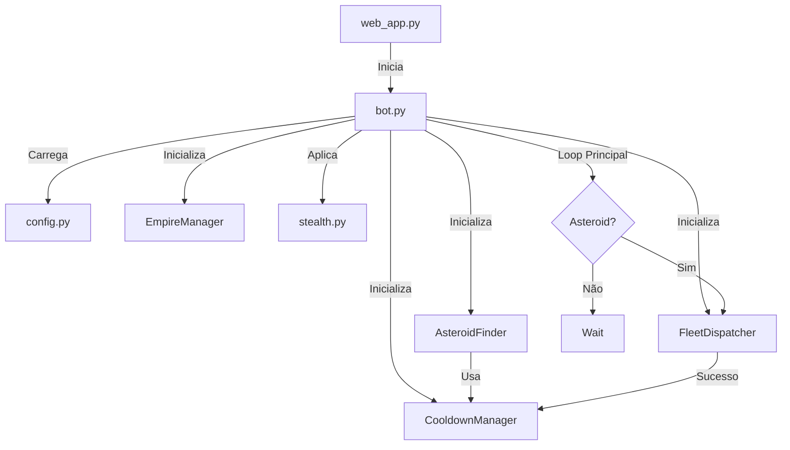
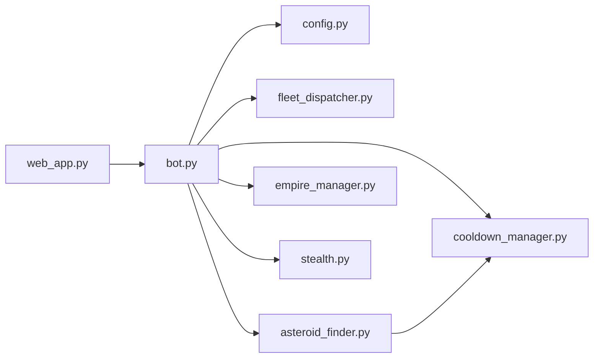

# 🔧 Documentação dos Módulos - Raidex-NinjaBot

Documentação técnica detalhada de todos os módulos do bot, suas responsabilidades, classes, métodos e fluxos de trabalho.

## 📋 Índice

- [Visão Geral da Arquitetura](#-visão-geral-da-arquitetura)
- [bot.py - Orquestrador Principal](#botpy---orquestrador-principal)
- [modules/config.py - Gerenciamento de Configurações](#modulesconfigpy---gerenciamento-de-configurações)
- [modules/asteroid_finder.py - Busca de Asteroides](#modulesasteroid_finderpy---busca-de-asteroides)
- [modules/cooldown_manager.py - Gerenciamento de Cooldowns](#modulescooldown_managerpy---gerenciamento-de-cooldowns)
- [modules/fleet_dispatcher.py - Envio de Frotas](#modulesfleet_dispatcherpy---envio-de-frotas)
- [modules/empire_manager.py - Gerenciamento do Império](#modulesempire_managerpy---gerenciamento-do-império)
- [modules/stealth.py - Modo Stealth](#modulesstealthpy---modo-stealth)
- [web_app.py - Interface Web](#web_apppy---interface-web)

## 🏗️ Visão Geral da Arquitetura

O bot segue uma arquitetura modular onde cada módulo tem uma responsabilidade única e bem definida:



## 🎮 bot.py - Orquestrador Principal

**Localização**: `bot.py`  
**Responsabilidade**: Orquestração principal, loop de execução, threading, logging

### Classe OgameBot

```python
class OgameBot:
    def __init__(self):
        self.running = False
        self.stop_flag = False
        self.thread = None
        self.loop = None
        self.cooldown_mgr = None
        self.empire_mgr = EmpireManager()
        self.browser_context = None
```

### Métodos Principais

#### `start()`
Inicia o bot em uma thread separada para não bloquear o servidor web.

```python
def start(self):
    if self.running:
        return
    self.running = True
    self.stop_flag = False
    self.thread = threading.Thread(target=self._run_async_loop)
    self.thread.start()
```

#### `stop()`
Para o bot definindo a flag de parada.

```python
def stop(self):
    if not self.running:
        return
    self.stop_flag = True
    self.running = False
```

#### `_main_logic()`
Loop principal assíncrono do bot.

**Fluxo de Execução**:
1. Carrega configurações
2. Inicializa módulos (CooldownManager, FleetDispatcher, AsteroidFinder)
3. Abre navegador com stealth
4. Navega para Galaxy
5. Loop infinito:
   - Busca asteroides
   - Se encontrado: envia frota e adiciona ao cooldown
   - Se não encontrado: espera 45-60 minutos
   - Se falha: espera tempo configurado

### Sistema de Logging

```python
class QueueHandler(logging.Handler):
    def emit(self, record):
        log_entry = self.format(record)
        timestamp = datetime.now().strftime("%H:%M:%S")
        log_queue.append(f"[{timestamp}] {log_entry}")
```

- Mantém últimas 100 linhas de log em `log_queue`
- Formato: `[HH:MM:SS] Mensagem`
- Acessível via API REST

## ⚙️ modules/config.py - Gerenciamento de Configurações

**Responsabilidade**: Carregamento e validação de configurações do arquivo `config.json`

### Funções Principais

#### `load_config()`
Carrega o arquivo `config.json` e retorna um dicionário.

```python
def load_config():
    try:
        with open(CONFIG_FILE, 'r') as f:
            return json.load(f)
    except FileNotFoundError:
        return {}
```

### Variáveis de Configuração

| Variável | Tipo | Descrição |
|----------|------|-----------|
| `USE_LOCAL_FILE` | bool | Usar arquivo HTML local |
| `HEADLESS_MODE` | bool | Navegador invisível |
| `FLEET_GROUP_NAME` | str | Nome do grupo de frotas |
| `FLEET_GROUPS` | dict | Mapeamento nome → UUID |
| `COOLDOWN_HOURS` | float | Horas de cooldown |
| `SEARCH_DELAY_MIN/MAX` | float | Delays entre buscas (s) |
| `NO_ASTEROID_WAIT_MIN/MAX` | int | Espera quando sem asteroids (min) |
| `BASE_SYSTEM` | int | Sistema do planeta base |
| `TRAVEL_TIME_RANGES` | list | Faixas de tempo de viagem |

## 🔍 modules/asteroid_finder.py - Busca de Asteroides

**Responsabilidade**: Detecção, parsing e validação de asteroides

### Classe AsteroidFinder

```python
class AsteroidFinder:
    def __init__(self, search_delay_min, search_delay_max, 
                 network_timeout, modal_timeout, base_system, 
                 travel_time_ranges):
        self.search_delay_min = search_delay_min
        self.search_delay_max = search_delay_max
        self.network_timeout = network_timeout
        self.modal_timeout = modal_timeout
        self.base_system = base_system
        self.travel_time_ranges = travel_time_ranges
```

### Métodos Principais

#### `find_asteroids(page, cooldown_mgr)`
Método principal que orquestra toda a busca.

**Retorno**: `(galaxy, system, position, range_start_sys, range_end_sys)` ou `None`

**Fluxo**:
1. Clica no botão "Find asteroids"
2. Espera modal aparecer
3. Extrai faixas de coordenadas do modal
4. Fecha modal
5. Para cada faixa, chama `_search_ranges()`
6. Retorna primeiro asteroide válido

#### `_parse_asteroid_ranges(page)`
Extrai faixas de asteroides do modal.

**Retorno**: `[(galaxy, system_start, system_end, position), ...]`

**Exemplo de parsing**:
```
Modal HTML: "[3:129:17] → [3:149:17]"
Retorna: (3, 129, 149, 17)
```

#### `_search_ranges(page, ranges, cooldown_mgr)`
Busca asteroides sistema por sistema em cada faixa.

**Fluxo**:
```python
for galaxy, start, end, position in ranges:
    for system in range(start, end + 1):
        # 1. Verifica cooldown
        if cooldown_mgr.is_in_cooldown(galaxy, system, position):
            continue
        
        # 2. Navega para o sistema
        # 3. Verifica se asteroide existe
        # 4. Obtém timer do asteroide
        # 5. Calcula distância e tempo necessário
        # 6. Valida se tempo é suficiente
        # 7. Clica no asteroide se válido
        # 8. Retorna coordenadas
```

#### `_get_asteroid_timer(page)`
Extrai o timer do asteroide da página.

**Return**: Tempo em minutos (float) ou `None`

**Parsing**: Converte "2h 30m" → 150.0 minutos

#### `_get_required_travel_time(distance)`
Calcula tempo mínimo necessário baseado na distância.

**Exemplo**:
```python
# BASE_SYSTEM = 247
# Asteroide em sistema 300
distance = abs(300 - 247) = 53

# TRAVEL_TIME_RANGES = [(24, 53, 25), ...]
# Distância 53 cai na faixa [24, 53]
# Retorna: 25 minutos
```

## ⏱️ modules/cooldown_manager.py - Gerenciamento de Cooldowns

**Responsabilidade**: Rastreamento de asteroides minerados para evitar duplicatas

### Classe CooldownManager

```python
class CooldownManager:
    def __init__(self, cooldown_file: str, cooldown_hours: float):
        self.cooldown_file = cooldown_file
        self.cooldown_hours = cooldown_hours
        self.cooldowns = self.load()
```

### Estrutura de Dados

```json
{
    "3:135:17": 1732228800.123,
    "3:220:17": 1732229100.456
}
```

- **Chave**: `"galaxy:system:position"`
- **Valor**: Timestamp Unix quando frota foi enviada

### Métodos Principais

#### `is_in_cooldown(galaxy, system, position)`
Verifica se um asteroide específico está em cooldown.

```python
def is_in_cooldown(self, galaxy, system, position) -> bool:
    asteroid_key = f"{galaxy}:{system}:{position}"
    
    if asteroid_key in self.cooldowns:
        sent_time = self.cooldowns[asteroid_key]
        elapsed_hours = (time.time() - sent_time) / 3600
        
        if elapsed_hours < self.cooldown_hours:
            return True  # Ainda em cooldown
        else:
            del self.cooldowns[asteroid_key]  # Expirou
            self.save()
    
    return False
```

#### `add_to_cooldown(galaxy, system, position)`
Adiciona asteroide ao cooldown após envio de frota.

```python
def add_to_cooldown(self, galaxy, system, position):
    asteroid_key = f"{galaxy}:{system}:{position}"
    self.cooldowns[asteroid_key] = time.time()
    self.save()
```

#### `cleanup_expired()`
Remove todos os cooldowns expirados.

```python
def cleanup_expired(self):
    current_time = time.time()
    expired_keys = []
    
    for asteroid_key, sent_time in self.cooldowns.items():
        elapsed_hours = (current_time - sent_time) / 3600
        if elapsed_hours >= self.cooldown_hours:
            expired_keys.append(asteroid_key)
    
    for key in expired_keys:
        del self.cooldowns[key]
    
    if expired_keys:
        self.save()
```

## 🚀 modules/fleet_dispatcher.py - Envio de Frotas

**Responsabilidade**: Seleção de grupo de frotas e navegação no wizard de envio

### Classe FleetDispatcher

```python
class FleetDispatcher:
    def __init__(self, fleet_group_name: str, fleet_group_value: str):
        self.fleet_group_name = fleet_group_name
        self.fleet_group_value = fleet_group_value
```

### Métodos Principais

#### `dispatch_to_asteroid(page, galaxy_url, target_coords=None)`
Envia frota para o asteroide clicado.

**Retorno**: `True` se sucesso, `False` se falha

**Fluxo do Wizard**:
```
1. Espera página Fleet carregar
2. Seleciona grupo de frotas via dropdown #fleetGroupSelect
3. Clica botão #btn-next-fleet2 (Step 1 → 2)
4. Clica botão #btn-next-fleet3 (Step 2 → 3)
5. Clica botão #btn-submit-fleet (Envia)
6. Navega de volta para Galaxy
```

**Código simplificado**:
```python
async def dispatch_to_asteroid(self, page, galaxy_url, target_coords=None):
    # Passo 1: Selecionar frota
    await page.select_option("#fleetGroupSelect", 
                            value=self.fleet_group_value)
    
    # Passo 2: Next (1 → 2)
    await page.click("#btn-next-fleet2")
    
    # Passo 3: Next (2 → 3)
    await page.click("#btn-next-fleet3")
    
    # Passo 4: Enviar
    await page.click("#btn-submit-fleet")
    
    # Retornar à galáxia
    await page.goto(galaxy_url)
    
    return True
```

## 🏛️ modules/empire_manager.py - Gerenciamento do Império

**Responsabilidade**: Coleta e parsing de dados do império (planetas, recursos, frotas)

### Classe EmpireManager

```python
class EmpireManager:
    def __init__(self, data_file="empire_data.json"):
        self.data_file = data_file
        self.data = self.load_data()
```

### Métodos Principais

#### `fetch_data(context)`
Busca dados do império usando o contexto do navegador.

**Fluxo**:
1. Cria nova página
2. Navega para `/empire`
3. Espera carregamento
4. Extrai HTML
5. Chama `parse_empire_html()`
6. Salva dados em JSON
7. Fecha página

#### `parse_empire_html(html_content)`
Extrai informações dos planetas do HTML usando BeautifulSoup.

**Dados Extraídos**:
- Nome e coordenadas do planeta
- Recursos (metal, crystal, deuterium, energy)
- Capacidade de armazenamento
- Produção por hora
- Edifícios e níveis
- Construções em andamento
- Naves disponíveis
- Defesas instaladas

**Estrutura de Retorno**:
```python
{
    "planets": [
        {
            "id": "uuid",
            "name": "Planeta",
            "coords": "[3:247:8]",
            "resources": {...},
            "storage": {...},
            "production": {...},
            "buildings": {...},
            "ships": {...},
            "defenses": {...}
        }
    ],
    "last_update": "2025-11-22T01:15:30"
}
```

## 🚀 modules/expedition_runner.py - Automação de Expedições

**Responsabilidade**: Gerenciamento e envio de expedições automáticas, controle de slots e modo sono.

### Classe ExpeditionRunner

```python
class ExpeditionRunner:
    def __init__(self, expedition_config: dict):
        self.config = expedition_config
        self.state = load_expedition_state()
```

### Métodos Principais

#### `run(context, stop_cb)`
Loop principal da expedição.
- Verifica "Modo Sono" (Sleep Mode)
- Executa ciclos de envio (`_execute_cycle`)
- Gerencia erros e retentativas

#### `_execute_cycle(context, stop_cb)`
Executa uma tentativa de envio de expedição.
1. Navega para página de auto-expedição
2. Verifica slots disponíveis
3. Seleciona grupo de frota configurado
4. Envia expedição
5. Retorna tempo de espera (cooldown)

#### `_sleep_window_remaining()`
Calcula se o bot deve estar dormindo baseado nos horários `sleep_start` e `wake_up`.

### Persistência de Estado
Utiliza `expedition_state.json` para manter:
- Contador de expedições
- Timestamp de atividade (para recuperar após reinício)

## 🧠 modules/brain.py - Brain (Auto Builder)

**Responsabilidade**: Lógica de construção automática baseada em metas definidas pelo usuário.

### Classe BrainManager

```python
class BrainManager:
    def __init__(self):
        self.planet_targets = {}
        self.targets_file = "brain_targets.json"
        self.state_db_path = "brain_state.db"
```

### Métodos Principais

#### `run_brain_task(context)`
Loop principal do Brain.
- Itera sobre todos os planetas com metas definidas
- Verifica se há construções em andamento (via banco de dados local)
- Navega para a página apropriada (Recursos ou Instalações)
- Verifica se o nível atual < nível alvo
- Inicia construção se possível

#### `set_targets(planet_id, targets)`
Define as metas de construção para um planeta específico.
- Salva em `brain_targets.json`

#### `_set_cooldown(planet_id, building_id, ready_at)`
Registra no SQLite (`brain_state.db`) quando uma construção ficará pronta, evitando verificações desnecessárias.

## 🥷 modules/stealth.py - Modo Stealth

**Responsabilidade**: Evasões anti-detecção de bot

### Funções Principais

#### `get_stealth_args()`
Retorna argumentos do Chrome para parecer mais humano.

```python
def get_stealth_args():
    return [
        "--disable-blink-features=AutomationControlled",
        "--disable-dev-shm-usage",
        "--disable-web-security",
        "--disable-features=IsolateOrigins,site-per-process",
        # ... mais argumentos
    ]
```

#### `apply_stealth(context)`
Aplica evasões JavaScript no contexto do navegador.

**Evasões Aplicadas**:
1. **WebDriver**: Remove `navigator.webdriver`
2. **Permissions**: Emula permissões de navegador real
3. **Plugins**: Adiciona plugins simulados
4. **Languages**: Define idiomas
5. **User-Agent**: Sobrescreve se necessário

**Código JavaScript injetado**:
```javascript
Object.defineProperty(navigator, 'webdriver', {
    get: () => undefined
});

navigator.permissions.query = (parameters) => (
    parameters.name === 'notifications' ?
        Promise.resolve({state: Notification.permission}) :
        Promise.resolve({state: 'granted'})
);
```

## 🌐 web_app.py - Interface Web

**Responsabilidade**: Servidor Flask, API REST, renderização de templates

### Rotas de Interface

| Rota | Método | Descrição |
|------|--------|-----------|
| `/` | GET | Página do minerador de asteroides |
| `/empire` | GET | Página do império |

### Rotas de API

| Rota | Método | Descrição |
|------|--------|-----------|
| `/api/status` | GET | Status do bot e logs |
| `/api/cooldowns` | GET | Asteroides em cooldown |
| `/api/start` | POST | Iniciar bot |
| `/api/stop` | POST | Parar bot |
| `/api/config` | GET | Obter configuração |
| `/api/config` | POST | Atualizar configuração |
| `/api/empire/data` | GET | Dados do império |
| `/api/empire/crawl` | POST | Disparar crawl manual |

### Exemplo de Endpoint

```python
@app.route('/api/start', methods=['POST'])
def start_bot():
    if not bot_instance.running:
        bot_instance.start()
        return jsonify({"status": "started"})
    return jsonify({"status": "already running"})
```

## 🔄 Fluxo Completo de Execução

### 1. Inicialização
```
web_app.py inicia → Flask roda na porta 5000
bot_instance criado mas não iniciado
```

### 2. Start do Bot
```
Usuário clica "Start" → POST /api/start
→ bot_instance.start()
→ Nova thread criada
→ _run_async_loop() executa
→ _main_logic() em loop assíncrono
```

### 3. Setup do Navegador
```
Playwright lança Chromium
→ Aplica stealth (stealth.py)
→ Carrega perfil persistente (user_data/)
→ Navega para Galaxy
```

### 4. Loop de Busca
```
Loop:
    1. asteroid_finder.find_asteroids()
       → Clica "Find asteroids"
       → Extrai ranges
       → Busca sistema por sistema
       → Valida cooldown (cooldown_manager)
       → Valida tempo de viagem
       → Retorna coordenadas
    
    2. Se encontrado:
       → fleet_dispatcher.dispatch_to_asteroid()
       → cooldown_manager.add_to_cooldown()
       → Continua buscando
    
    3. Se não encontrado:
       → Espera 45-60 min aleatório
       → Repete
```

### 5. Logs e Monitoramento
```
Toda ação → logger.info()
→ QueueHandler adiciona a log_queue
→ /api/status retorna logs
→ Interface atualiza a cada 2s
```

## 📊 Diagrama de Dependências



## 💡 Dicas para Desenvolvedores

### Adicionar Novo Módulo

1. **Crie o arquivo**: `modules/meu_modulo.py`
2. **Defina a classe**:
   ```python
   class MeuModulo:
       def __init__(self, config_param):
           self.config_param = config_param
       
       async def minha_funcao(self, page):
           # Implementação
           pass
   ```
3. **Importe em bot.py**:
   ```python
   from modules.meu_modulo import MeuModulo
   ```
4. **Inicialize no `__init__` ou `_main_logic`**:
   ```python
   meu_modulo = MeuModulo(PARAM_VALUE)
   ```

### Adicionar Nova Configuração

1. **Adicione ao `config.json`**:
   ```json
   {
       "MINHA_CONFIG": 42
   }
   ```
2. **Carregue em `modules/config.py`**:
   ```python
   MINHA_CONFIG = _config.get("MINHA_CONFIG", 42)
   ```
3. **Use em qualquer módulo**:
   ```python
   from modules.config import MINHA_CONFIG
   ```

## 📖 Referências

- [README.md](../README.md) - Documentação principal
- [CONFIGURATION.md](CONFIGURATION.md) - Guia de configuração
- [API.md](API.md) - Documentação da API REST

---

**🔧 Contribuições**: Ao modificar módulos, mantenha esta documentação atualizada!
